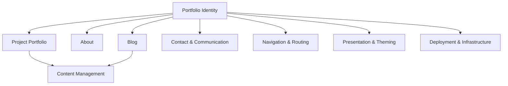

# Domains

> [!info] Domain-Driven Design
> This software is organized into bounded contexts, each with its own ubiquitous language.

## Domain Map

## Bounded Contexts

### Core Domains

| Domain | Responsibility | Key Entities |
|--------|----------------|--------------|
| [[portfolio-identity\|Portfolio Identity]] | Professional identity presentation | Hero, HomeCard, NavBar, Footer |
| [[project-portfolio\|Project Portfolio]] | Software project showcase | Project, Contributor, Tool, Tag |
| [[about\|About]] | Personal narrative | Personal Narrative |
| [[blog\|Blog]] | Written content (Substack) | Blog Embed |

### Supporting Domains

| Domain | Responsibility | Key Entities |
|--------|----------------|--------------|
| [[contact-communication\|Contact & Communication]] | Visitor outreach | Contact Form, Social Link |
| [[content-management\|Content Management]] | MDX content handling | Collection, Entry, Schema |
| [[navigation-routing\|Navigation & Routing]] | Site structure and URLs | Route, Slug, Static Path |
| [[presentation-theming\|Presentation & Theming]] | Visual appearance | Theme, Color Token, Typography |
| [[deployment-infrastructure\|Deployment & Infrastructure]] | Docker and Nginx | Container, Build Stage, Runtime |

## Cross-Cutting Concerns

- **Search & Discovery**: Client-side filtering in [[project-portfolio#SearchBar\|ProjectCard]] components
- **External Integrations**: Substack (blog), LinkedIn, GitHub
- **Asset Management**: SVGs, project images, theme icons

---

> [!see-also] 
> [[ubiquitous-language/glossary|Glossary]] for term definitions
